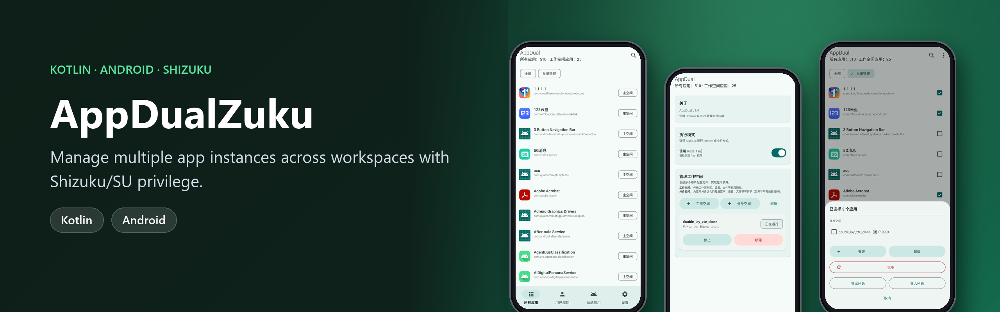
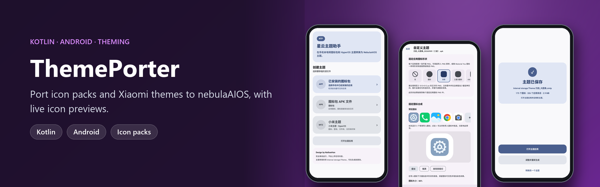
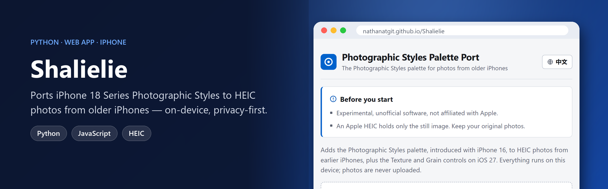
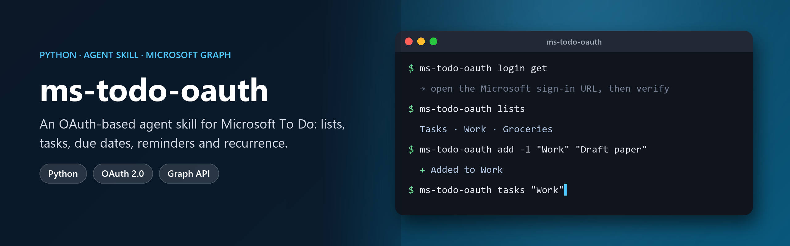

## 🔊 About Me

I work mainly on **acoustic signal processing**, focusing on:

- Acoustic communication engineering
- Acoustic integrated sensing and communication (ISAC)

I'm also interested in image processing and autonomous control.

## 🛠️ Side Projects

